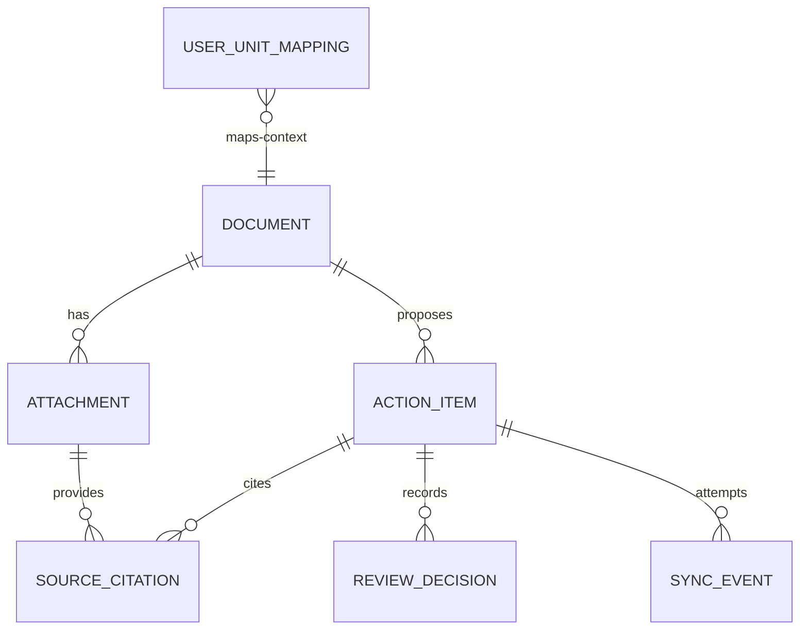

# G02 Domain Schema

## Goal

G02 adds a canonical business schema for the future flow:

QLVB -> Document -> Attachment -> ActionItem -> SourceCitation -> ReviewDecision -> SyncEvent -> Planner KPI.

The scope is schema, models, validation, additive SQLite persistence, compatibility tests, and documentation. G02 does not implement OCR runtime, AI calls, production prompts, review UI, real Planner KPI sync, SharePoint/OneDrive, real QLVB access, or EXE builds.

## Entity Relationship



## Entities

### Document

A canonical source document from QLVB or another future source. `source_system`, `source_document_id`, and `source_revision` form the dedupe key. `document_number` is nullable because not every source record has a formal number.

Required domain fields include `id`, `tenant_id`, `source_system`, `source_document_id`, `source_revision`, `document_type`, `content_sha256`, `ingest_status`, `created_at`, `updated_at`, and `schema_version`.

### Attachment

A file attached to a document. It remains compatible with G01 attachment statuses: `DISCOVERED`, `DOWNLOAD_STARTED`, `DOWNLOADED_RAW`, `VALIDATED`, `INVALID_FILE`, and `DOWNLOAD_FAILED`.

### ActionItem

A proposed task extracted from a document. AI output remains a proposal and does not become an official task until review approval. Supported statuses are `PROPOSED`, `PENDING_REVIEW`, `NEEDS_CORRECTION`, `APPROVED`, `REJECTED`, `SYNC_PENDING`, `SYNCING`, `SYNCED`, and `SYNC_ERROR`.

Only `APPROVED` and `SYNC_PENDING` are eligible for future sync. G02 does not send data to Planner KPI.

### SourceCitation

A citation from source text to an action item. Excerpts are capped by `MAX_CITATION_EXCERPT_CHARS` and hashed with SHA-256. Page and character ranges are optional but validated when present.

### ReviewDecision

Append-only audit history for user or system review. It stores deterministic before/after JSON strings and never overwrites prior decisions.

### SyncEvent

A future sync attempt record. It stores idempotency keys, attempt numbers, status, remote identifiers, and hashes of request/response bodies. It does not store bearer tokens or raw request/response bodies.

### UserUnitMapping

Mapping from source user/unit keys to target Planner KPI user/unit identifiers. Ambiguous mapping defaults to `NEEDS_REVIEW`; display name is not used as a unique key.

## Enums And State

- Document type: `INCOMING`, `OUTGOING`, `INTERNAL`, `OTHER`
- Ingest status: `NEW`, `INGESTED`, `EXTRACTED`, `AI_ANALYZED`, `ERROR`
- Action item status: `PROPOSED`, `PENDING_REVIEW`, `NEEDS_CORRECTION`, `APPROVED`, `REJECTED`, `SYNC_PENDING`, `SYNCING`, `SYNCED`, `SYNC_ERROR`
- Review decision: `APPROVE`, `REJECT`, `REQUEST_CHANGES`, `EDIT_AND_APPROVE`
- Sync event status: `PENDING`, `IN_PROGRESS`, `SUCCEEDED`, `RETRYABLE_FAILED`, `PERMANENT_FAILED`, `CANCELLED`
- Mapping status: `ACTIVE`, `INACTIVE`, `NEEDS_REVIEW`

## Unique Constraints

- Document dedupe: unique index on `documents(tenant_id, source_system, source_document_id, source_revision)` when source identifiers are present.
- Sync idempotency: `sync_events.idempotency_key` is unique.
- User mapping: `user_unit_mappings(tenant_id, source_system, source_key, target_role)` is unique.

## Migration Strategy

G02 is additive. It extends the existing legacy `documents` table and adds new tables: `attachments`, `action_items`, `source_citations`, `review_decisions`, `sync_events`, `user_unit_mappings`, and `schema_migrations`.

`init_domain_schema()` is idempotent and records migration version `g02_domain_schema_1`. It does not drop or rename legacy tables or columns.

## Backward Compatibility

Manifest schema `2.0.0` is unchanged. Existing downloader, queue, GUI and sync client fields remain readable. `StorageManager.get_queue_item_files()` still reads current queue format and the old fallback `READY` layout.

## Privacy And Security

Domain entities do not store tokens, cookies, bearer credentials, or raw request/response bodies. Sync events store request and response hashes only. Source URL handling avoids logging sensitive query material in existing utility code.

## JSON Example

```json
{
  "document": {
    "id": "doc-1",
    "tenant_id": "tenant-a",
    "source_system": "QLVB",
    "source_document_id": "qlvb-123",
    "source_revision": "1",
    "document_type": "INCOMING",
    "document_number": null,
    "issued_date": "2026-07-19",
    "subject": "Chi dao xu ly cong viec",
    "schema_version": "1.0.0"
  },
  "attachments": [
    {"id": "att-1", "document_id": "doc-1", "file_name": "main.pdf", "validation_status": "VALIDATED"},
    {"id": "att-2", "document_id": "doc-1", "file_name": "appendix.docx", "validation_status": "VALIDATED"}
  ],
  "action_items": [
    {"id": "action-1", "document_id": "doc-1", "ordinal": 1, "title": "Xu ly van ban", "status": "PROPOSED"},
    {"id": "action-2", "document_id": "doc-1", "ordinal": 2, "title": "Bao cao ket qua", "status": "PENDING_REVIEW"}
  ],
  "citation": {"id": "cit-1", "action_item_id": "action-1", "document_id": "doc-1", "attachment_id": "att-1", "page_start": 1, "page_end": 1, "excerpt_sha256": "..."},
  "review_decision": {"id": "review-1", "action_item_id": "action-1", "decision": "APPROVE", "reviewer_id": "user-1"},
  "sync_event": {"id": "sync-1", "action_item_id": "action-1", "target_system": "PlannerKPI", "idempotency_key": "tenant-a/doc-1/action-1", "status": "PENDING"}
}
```

## Not Implemented In G02

- OCR runtime
- AI production prompt/call
- Review UI
- Real Planner KPI task sync
- SharePoint/OneDrive upload
- Real QLVB access
- EXE packaging
