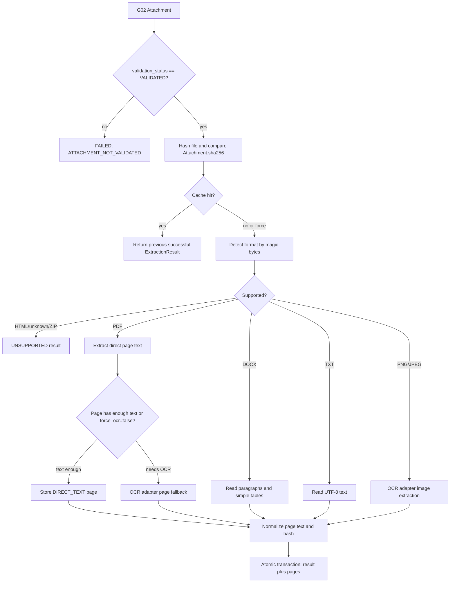

# G03 Extraction And OCR Architecture

G03 adds attachment-level content extraction for files that G01/G02 already marked as `VALIDATED`. It does not call AI, does not create review tasks, does not call Planner KPI, and does not access live QLVB.

## Scope

| Function | Canonical before G03 | Source B reference | G03 approach |
| --- | --- | --- | --- |
| Legacy manifest extraction | `tools/qlvb_downloader/extractor.py` stores excerpt fields in manifest | Source B extracts text while building AI prompts | Keep legacy extractor unchanged; add attachment-domain service |
| PDF direct text | `pdfminer.six` in legacy extractor | `pypdf` in Source B | Use installed `pdfminer.six`, page by page |
| PDF scan fallback | Legacy returns OCR-required status | PyMuPDF render plus Tesseract OCR | Add OCR adapter interface and optional Tesseract adapter |
| DOCX | Paragraph extraction only | `python-docx` paragraph extraction | Extract paragraphs and simple tables |
| TXT | UTF-8 and several legacy fallbacks | UTF-8 text read | G03 supports UTF-8/UTF-8-SIG only |
| Images | Not handled by legacy extractor | Tesseract OCR for image files | Image OCR through adapter, fake adapter in tests |
| Persistence | Document index has excerpt/status only | Source B writes derived working files | Add `extraction_results` and `extracted_pages` |
| Cache | None for attachment extraction | Not isolated by content hash | Cache by attachment, source hash, extractor version, OCR version |

## Flow

## Modules

- `tools/qlvb_downloader/extraction_models.py`
  - `ExtractionResult`, `ExtractedPage`
  - `ExtractionMethod`: `DIRECT_TEXT`, `OCR`, `MIXED`, `UNSUPPORTED`
  - `ExtractionStatus`: `PENDING`, `PROCESSING`, `SUCCEEDED`, `SUCCEEDED_WITH_WARNINGS`, `NO_TEXT`, `UNSUPPORTED`, `FAILED`
  - `normalize_extracted_text()`, stable text hashing and validation helpers
- `tools/qlvb_downloader/ocr_adapter.py`
  - `OcrAdapter` interface
  - `OptionalTesseractOcrAdapter`, used only when installed and configured
- `tools/qlvb_downloader/extraction_repository.py`
  - additive migration `g03_extraction_schema_1`
  - `extraction_results`, `extracted_pages`
  - cache lookup and atomic save
- `tools/qlvb_downloader/extraction_service.py`
  - GUI-independent service: `ExtractionService.extract_attachment(...)`
  - validates attachment state, hash, format, cache and persistence

## Supported Formats

- PDF: direct text by page via `pdfminer.six`; OCR fallback per page when text is almost empty or `force_ocr=True`.
- DOCX: paragraph text and basic table rows through `python-docx`; macros are not executed.
- TXT: UTF-8 or UTF-8-SIG text.
- PNG/JPEG: OCR through `OcrAdapter`.
- ZIP: detected by magic bytes, not expanded by G03.
- HTML disguised as another extension: rejected as `UNSUPPORTED`.

## Normalization

`normalize_extracted_text(text)` applies:

- Unicode NFC
- CRLF/CR to LF
- removal of null and unsupported control characters
- preservation of Vietnamese accents
- no spelling correction, summarization, number conversion, or layout-destroying whitespace collapse

Each page stores `text_sha256`. The result stores `normalized_text_sha256` over page text joined with a page delimiter.

## Persistence

Migration version: `g03_extraction_schema_1`.

Tables:

- `extraction_results`
- `extracted_pages`

Important constraints:

- FK to `documents(doc_id)` and `attachments(id)`
- indexes by attachment, document and status
- unique cache key: `attachment_id`, `source_file_sha256`, `extractor_name`, `extractor_version`, `ocr_version`
- `page_number` starts at 1 and is unique per result

The repository saves result and pages in one transaction. If page insertion fails, the transaction is rolled back and the service records a failed result without partial pages.

## Error Handling

The service returns structured result rows for:

- `ATTACHMENT_NOT_FOUND`
- `DOCUMENT_ATTACHMENT_MISMATCH`
- `ATTACHMENT_NOT_VALIDATED`
- `FILE_NOT_FOUND`
- `HASH_MISMATCH`
- `HTML_DISGUISED_FILE`
- `ZIP_CONTAINER_NOT_EXTRACTED`
- `UNSUPPORTED_FORMAT`
- `EXTRACTION_FAILED`

Old successful results are not deleted before extraction starts. Replacement happens inside the final save transaction.

## Security

- No secrets, tokens, cookies, raw sessions, raw API payloads, or live QLVB data are read or stored.
- File type detection uses magic bytes before extension-based assumptions.
- DOCX is read as an Office Open XML zip package through `python-docx`; macros are not executed.
- ZIP is detected only and not extracted in G03.
- OCR is optional and local. No AI/API or Planner KPI call is made.

## Source B Ideas Reused

Source B showed the useful production direction for PDF scan handling: use OCR as a fallback only after direct PDF text extraction fails, support Vietnamese OCR with `vie+eng`, and degrade gracefully when OCR dependencies are missing. G03 reimplements that design as a small adapter contract instead of copying Source B modules.

## Not Implemented In G03

- AI action item extraction
- review queue/UI
- Planner KPI HTTP sync
- SharePoint/OneDrive upload
- OCR installation, model download or Tesseract configuration UI
- ZIP recursive extraction and OCR
- DOC binary conversion
- production EXE/build changes
