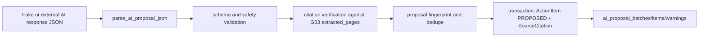

# G04 AI Proposal Boundary

## Goal

G04 defines the boundary between an AI proposal response and the Canonical G02/G03 domain. It does not call a production AI provider, QLVB, Planner KPI, SharePoint, or OneDrive. The only supported path is ingesting a JSON response, validating it, verifying citations against extracted pages, and persisting proposed action items for later review.

Contract version: `AI_PROPOSAL_SCHEMA_VERSION = "1.0.0"`.

## Flow

## Modules

- `tools/qlvb_downloader/ai_proposal_models.py`: schema version, dataclasses, warning limits, fingerprint helpers.
- `tools/qlvb_downloader/ai_proposal_validation.py`: strict JSON parser and field validation.
- `tools/qlvb_downloader/ai_proposal_repository.py`: additive SQLite migration and transactional persistence.
- `tools/qlvb_downloader/ai_proposal_service.py`: service API, fake provider contract, citation verification, dedupe, idempotency.

## Validation

The parser accepts only a JSON object matching the G04 envelope. In strict mode, unknown fields are rejected. Missing fields are not inferred. Invalid schema version, invalid due date, unsupported enum values, excessive payload length, excessive proposal/citation counts, and confidence outside `0.0..1.0` are rejected.

AI output cannot set `APPROVED`, `SYNC_PENDING`, `SYNCED`, or `SYNCING`. New action items are always persisted as `PROPOSED`.

## Citation Verification

Each citation is checked against G03 data:

- the document exists;
- the attachment exists and belongs to the same document;
- every page in the requested range exists in a successful extraction result;
- the excerpt appears exactly, whitespace-normalized, or loose-normalized in the extracted text;
- fuzzy/loose matches are stored with a `CITATION_FUZZY_MATCH` warning;
- `excerpt_sha256` and `source_text_sha256` are recomputed by Canonical.

Invalid cross-document, missing attachment, missing page, or missing excerpt citations reject the proposal.

## Deduplication

The stable proposal fingerprint includes document id, normalized title, normalized description, proposed unit, due date, expected output, and citation page/range. `external_proposal_id` is not trusted as the unique key.

Statuses:

- `NEW`: persisted normally.
- `EXACT_DUPLICATE`: no second `ActionItem` is created.
- `POSSIBLE_DUPLICATE`: persisted with warning for reviewer attention.

Deduplication is scoped to the same document.

## Persistence And Idempotency

Migration `g04_ai_proposal_schema_1` creates:

- `ai_proposal_batches`
- `ai_proposal_items`
- `ai_proposal_warnings`

Batch metadata includes model name/version, prompt version, generated time, counts, status, and a stable SHA-256 of the response. Raw response body and tokens are not stored.

ActionItem and SourceCitation inserts occur in one SQLite transaction per proposal. If citation insertion fails, the action item insert for that proposal is rolled back. Reusing the same idempotency key returns the existing batch and does not create duplicates.

## Security

G04 contains no production Gemini/OpenAI client and no API key handling. It uses `json.loads`, never `eval` or `exec`. It does not create sync events and does not call Planner KPI.

## Not Implemented In G04

- Production AI provider client.
- Prompt execution.
- Review UI.
- Planner KPI sync.
- SharePoint/OneDrive upload.
- Human approval workflow.
