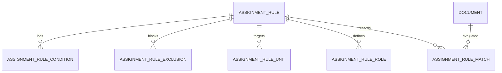

# G05A Assignment Rule Schema

## Goal

G05A adds a library-only assignment rule domain for mapping canonical documents and proposed action items to rule-based unit and role suggestions. It builds schema, models, validation, additive SQLite persistence, and compatibility tests.

G05A does not choose specific people, call AI, call SharePoint, create Planner payloads, build UI, access live QLVB, or implement the final scoring engine. Scoring is reserved for G05A engine work in the next command.

Schema version: `ASSIGNMENT_RULE_SCHEMA_VERSION = "1.0.0"`.

Migration version: `g05a_assignment_rule_schema_1`.

Runtime entrypoint: `LIBRARY_ONLY`; migration runs when `AssignmentRuleRepository` is initialized.

## Entity Relationship

## Entities

### AssignmentRule

The durable versioned policy record. Rules are unique by `tenant_id`, `rule_code`, and `version`. Each rule has a status, effective date range, priority, minimum confidence, due-date defaults, draft metadata, source reference, and version.

Only `ACTIVE` rules are eligible for future matching. `DRAFT`, `INACTIVE`, and `SUPERSEDED` rules remain stored but are ignored by `list_active_rules`.

### AssignmentRuleCondition

A positive signal attached to a rule. Conditions store a type, raw value, normalized value, weight, required flag, match mode, and sort order.

Supported match modes are `EXACT`, `CONTAINS`, `TOKEN`, `PREFIX`, and `REGEX_SAFE`. `REGEX_SAFE` is validated for bounded pattern length and compilability.

### AssignmentRuleExclusion

A negative signal attached to a rule. Hard exclusions remove a rule from future results. Non-hard exclusions can later contribute a penalty. G05A stores the data and validates non-negative penalty but does not implement full scoring yet.

### AssignmentRuleUnit

A rule-level target unit. G05A stores only `source_unit_key` and `unit_name`, not people or Planner user IDs. Unit types are `LEAD_UNIT` and `COORDINATING_UNIT`.

### AssignmentRuleRole

A rule-level role assignment hint. G05A stores `role_code` and `unit_source_key` only. It does not store specific users. Role types are `LEADER`, `MONITOR`, `LEAD_EXECUTOR`, and `CO_EXECUTOR`.

### AssignmentRuleMatch

Append-only match history for later evaluation output. It records document id, document revision, rule identity/version, score, decision, counts, bounded explanation, bounded warnings JSON, input fingerprint, and created time.

It does not store full document text, tokens, cookies, credentials, Planner payloads, or SharePoint data.

## Enums

Rule status:

- `DRAFT`
- `ACTIVE`
- `INACTIVE`
- `SUPERSEDED`

Condition type:

- `DOMAIN`
- `SUBDOMAIN`
- `DOCUMENT_TYPE`
- `ISSUER_GROUP`
- `REQUIRED_ACTION`
- `REQUIRED_KEYWORD`
- `PREFERRED_KEYWORD`
- `TARGET_ENTITY`
- `EXPECTED_OUTPUT`

Exclusion type:

- `EXCLUDED_KEYWORD`
- `EXCLUDED_ACTION`
- `EXCLUDED_ISSUER`
- `EXCLUDED_DOCUMENT_TYPE`

Unit type:

- `LEAD_UNIT`
- `COORDINATING_UNIT`

Role type:

- `LEADER`
- `MONITOR`
- `LEAD_EXECUTOR`
- `CO_EXECUTOR`

Match decision:

- `MATCHED`
- `MATCHED_WITH_WARNING`
- `NEEDS_CLASSIFICATION`
- `EXCLUDED`
- `NO_MATCH`

Match warning code:

- `MULTIPLE_TOP_RULES`
- `LOW_CONFIDENCE`
- `MISSING_REQUIRED_SIGNAL`
- `UNIT_UNRESOLVED`
- `ROLE_UNRESOLVED`
- `RULE_NEAR_EXPIRY`
- `CONFLICTING_RULES`

## Effective Dates

Rules, units, and roles can carry effective date ranges. `effective_to` cannot be before `effective_from`. `list_active_rules(as_of_date, tenant_id)` returns only rules where:

- `status = ACTIVE`
- `tenant_id` matches
- `effective_from` is null or on/before `as_of_date`
- `effective_to` is null or on/after `as_of_date`

## Conditions And Exclusions

Conditions and exclusions store normalized values for deterministic matching. Required conditions are persisted but the full required-signal scoring algorithm is not implemented in G05A schema work.

Duplicate conditions inside the same rule are rejected by type, normalized value, and match mode. Duplicate lead units are rejected. Multiple required roles of the same type are rejected to avoid ambiguous mandatory routing.

## Units And Roles

G05A stores unit keys and role codes only:

- no personnel directory;
- no specific human assignee;
- no Planner user ID;
- no SharePoint identity.

Specific person resolution belongs to G05B.

## Match History

Match history is append-only. `append_match()` inserts a new row and never updates old history. `supersede_rule()` changes the rule status without deleting matches. Rule rows referenced by match history are protected by foreign keys.

Scores are bounded `0..100`. `input_fingerprint` must be SHA-256. Explanations and warnings JSON are size-limited.

## Migration

`init_assignment_rule_schema()` creates:

- `assignment_rules`
- `assignment_rule_conditions`
- `assignment_rule_exclusions`
- `assignment_rule_units`
- `assignment_rule_roles`
- `assignment_rule_matches`

The migration is additive and idempotent. It records `g05a_assignment_rule_schema_1` in `schema_migrations`, uses parameterized SQL for data writes, and does not drop or delete G01-G04 data.

Important indexes:

- `assignment_rules(tenant_id, status, effective_from, effective_to)`
- `assignment_rule_conditions(rule_id, condition_type)`
- `assignment_rule_exclusions(rule_id, exclusion_type)`
- `assignment_rule_units(rule_id, unit_type)`
- `assignment_rule_roles(rule_id, role_type)`
- `assignment_rule_matches(document_id, document_revision)`
- `assignment_rule_matches(rule_id)`
- `assignment_rule_matches(input_fingerprint)`

## Security

G05A is local SQLite persistence only. It does not:

- call AI;
- call SharePoint;
- call Planner KPI;
- call QLVB;
- store tokens, cookies, passwords, browser sessions, or raw credentials;
- store full extracted document text in match history;
- create build artifacts or runtime data.

## Not Implemented In G05A Schema

- scoring engine;
- final rule matching algorithm;
- person-specific assignment;
- Planner payload generation;
- SharePoint upload;
- review UI;
- GUI wiring;
- AI provider execution;
- real QLVB access.
