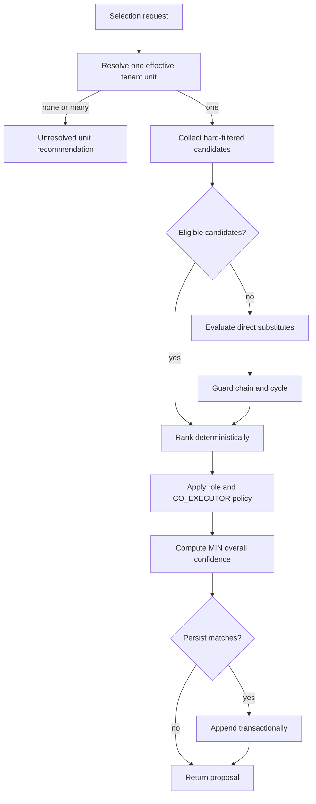
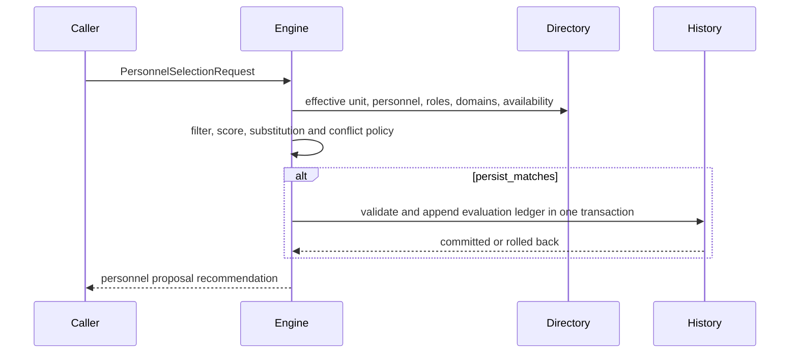
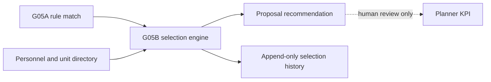

# G05B Personnel Selection Engine

## Purpose and boundary

G05B turns the approved G05A rule match, directory records, and a fixed reference
date into deterministic personnel recommendations. Engine version:
`g05b.selection.1`.

The result is a personnel proposal only. It is not an assignment decision, does
not approve a leader decision in SmartOfficeAI360, and does not create an
Assignment Draft. Office staff review the proposal in Planner KPI; Planner
identity mapping is not implemented. This phase does not call SharePoint or
Planner, import Excel v1, use real operational data, or store document full text
or chain-of-thought.

G05A owns deterministic assignment-rule matching and the proposed lead unit.
G05B owns the tenant-safe personnel/unit directory and this proposal engine. The
engine consumes `RuleRoleType` and a G05A rule-match reference without changing
the G05A engine.

## Input contract

`PersonnelSelectionRequest` contains a tenant, document id and revision,
optional assignment-rule-match id, rule code/version, rule confidence,
`lead_unit_source_key`, required roles, domain/subdomain codes, ISO reference
date, and requested CO_EXECUTOR count. The engine rejects invalid dates,
confidence outside 0-100, and requested count outside 0-10. It reads only the
directory and document metadata needed by append-only audit history.

## Output contract

`PersonnelSelectionRecommendation` contains the resolved unit, ordered role
recommendations, `unresolved_roles`, `conflicting_roles`, overall confidence,
canonical input fingerprint, engine version, bounded warnings, and a short
proposal-only explanation. A role recommendation contains selected id(s),
alternatives, score-derived confidence, decision, and bounded diagnostics. It
never exposes availability reasons, substitution reasons, credentials, document
text, or a reasoning trace.

## Resolution and candidate ledger

The engine resolves exactly one ACTIVE, effective-dated unit for the tenant and
source unit key. No match produces `UNIT_NOT_FOUND`; multiple matches produce
`UNIT_VERSION_CONFLICT`. It canonically orders roles as LEADER, MONITOR,
LEAD_EXECUTOR, CO_EXECUTOR.

For every evaluated candidate the engine keeps an in-memory evaluation ledger.
Canonical candidate identity is `(tenant_id, personnel_id, role_type)`: one
evaluation and at most one persisted match exist for that identity in one
operation. The engine first collects source rows, groups them by canonical
identity, aggregates sorted unique role/domain evidence, chooses the highest
applicable role priority and domain responsibility, and only then ranks,
detects conflicts, applies CO_EXECUTOR limits, and persists. Duplicate source
rows never add score more than once.

With persistence enabled, valid candidate evaluations are appended as
`PersonnelSelectionMatch` history. The ledger supports unselected availability
diagnostics without turning them into selected personnel. It does not store
title, summary, full document content, raw input payload, external identity, or
private availability/substitution reason.

## Hard filters

Candidate collection applies these deterministic filters before ranking:

- tenant isolation for unit, personnel, role, domain, availability, and
  substitution rows;
- ACTIVE personnel status and effective-date window;
- matching primary unit and effective-dated role assignment;
- available status at the reference date;
- domain/subdomain match for LEAD_EXECUTOR and CO_EXECUTOR.

LEADER and MONITOR may remain eligible without a matching domain, with
`DOMAIN_NOT_MATCHED`; executor roles require a matching domain. A missing
availability record means AVAILABLE. LEAVE, TEMPORARILY_UNAVAILABLE, and
UNAVAILABLE block a person. More than one distinct effective availability status
is an `AVAILABILITY_CONFLICT`, is deterministic, and blocks selection without
revealing the private reason.

## Scoring and conflicts

Scores are clamped to 0-100 from unit (30), role (25), primary role (10),
domain responsibility (PRIMARY 25, SECONDARY 15, SUPPORT 8), and availability
(10). Rankings use score descending, source person key, then person id, so ties
are stable.

For single-person roles, the top two eligible candidates within conflict delta
`3.0` yield `CONFLICT`, no selected person, and deterministic alternatives.
CO_EXECUTOR does not create a conflict merely because candidates have equal
scores; it selects deterministically instead.

## Required roles and CO_EXECUTOR

Every required role receives one recommendation. A role is unresolved for
NO_ELIGIBLE_PERSON, NEEDS_CLASSIFICATION, CONFLICT, or an explicit required-role
warning such as a CO_EXECUTOR count shortfall. These roles appear in
`unresolved_roles`; conflicts also appear in `conflicting_roles`.

CO_EXECUTOR candidates must score at least 75. The engine selects at most the
requested count, preserves deterministic order, sends excess candidates to
alternatives, and returns no selection when requested count is zero. A partial
selection has `CO_EXECUTOR_COUNT_SHORTFALL` and remains unresolved. A person
already selected as LEAD_EXECUTOR is removed from the CO_EXECUTOR candidate
list, preventing duplicate lead/co-executor selection. Selected ids and
alternatives are unique personnel identities; the requested count is applied
after canonicalization.

Overall confidence is the MIN of rule confidence, resolved unit confidence
(100 after a unique resolution), and every selected role confidence. It is not
an average; an unresolved result with no selection is 0.

## Substitution

The engine considers a substitute only when no normal eligible candidate exists.
The primary must have an effective primary role for the resolved unit. The
substitute must be same-tenant, ACTIVE, have exactly one effective
`PersonnelRecord` version at the reference date, be role/unit/domain eligible,
and be AVAILABLE. Personnel record boundaries are inclusive. No effective
version produces `PERSONNEL_OUTSIDE_EFFECTIVE_DATE`; multiple overlapping ACTIVE
versions produce `PERSONNEL_DIRECTORY_INCOMPLETE` and are never auto-selected.

If a canonical identity is observed through both direct and substitute paths,
the eligible direct candidate wins: it remains non-substitute, has no score cap,
and has no `SUBSTITUTE_USED` warning. An eligible direct substitute has `is_substitute=true`,
`SUBSTITUTE_USED`, decision at most `SELECTED_WITH_WARNING`, and score capped at
80.

Only one substitution level is supported. For A -> B -> C, the engine may use B
but never escalates to C. An ineligible B records
`SUBSTITUTION_CHAIN_UNSUPPORTED`. The engine independently detects self, two,
and longer cycles in legacy/bad data; it selects no cycle participant and records
`SUBSTITUTION_CYCLE_DETECTED`. A blocked substitution for CO_EXECUTOR retains
the chain/cycle warning, count shortfall, and unresolved role warning.

## Persistence, fingerprint, and security

When `persist_matches=True`, selection history is append-only. One operation
deduplicates a person/role pair before insert; a later evaluation appends new
rows and never updates prior history. Batch insertion validates all matches and
uses one SQLite transaction, so an insert failure rolls back that persistence
operation. It does not modify directory records or G05A rule matches.

The input fingerprint is canonical SHA-256 over engine version, tenant,
document/revision, G05A match reference, unit source key, sorted unique role
values, sorted unique domains/subdomains, and reference date. Ordering or
duplicate input values do not change it.

Selection explanations are limited to 2,000 characters. Warnings are a
validated allow-list with at most 16 items, each at most 80 characters, and at
most 4,000 serialized characters. The persistence validator rejects sensitive
content patterns such as credentials, cookies, URLs, local paths, SQL text, and
tracebacks. All repository SQL uses parameters; the engine has no network or AI
client.

## Deterministic flow

## Not implemented

- Planner identity mapping, Planner calls, and Planner synchronization.
- Assignment Draft creation, leadership approval, or automatic task assignment.
- SharePoint calls, Excel v1 import, AI calls, real-data ingestion, GUI, and
  runtime scheduling.
- Multi-level substitution, automatic conflict resolution, and person-level
  availability reason disclosure.
