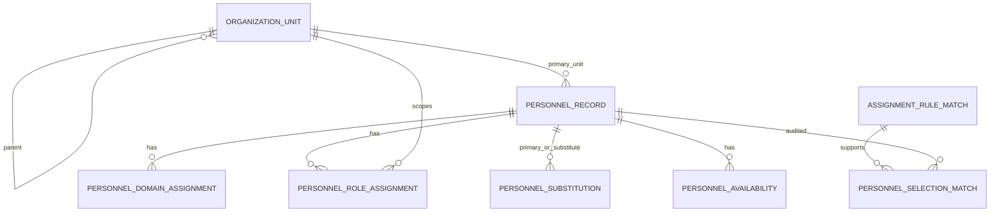

# G05B Personnel and Unit Directory Schema

## Goal and boundary

G05B provides a library-only, tenant-safe SQLite directory for organization units and personnel records. It is the persistence boundary for future personnel proposal work, not a person-selection engine. G05A remains responsible for deterministic unit and role recommendations; G05B consumes its source unit keys and `RuleRoleType` values without modifying the G05A engine.

Schema version: `1.0.0`. Migration: `g05b_personnel_unit_directory_schema_1`. Runtime entrypoint: `LIBRARY_ONLY` through `PersonnelDirectoryRepository`.

G05B does not import Excel, select people, create Assignment Drafts, map Planner identities, create Planner payloads, call AI/QLVB/SharePoint/Planner, build UI, or use real data.

## Entity relationship

## Directory entities

`OrganizationUnit` uses stable `source_unit_key`, positive source `record_version`, code/name, normalized search name, unit type/status, parent, temporal bounds, provenance, and separate `row_version` optimistic locking. The unique key is `(tenant_id, source_unit_key, record_version)`. Parent relations are tenant-safe and cycle-free. ACTIVE versions of one source key cannot overlap.

`PersonnelRecord` uses stable `source_person_key`, source record version, name/search normalization, optional position and primary unit, status, temporal bounds, provenance, and row version. Names are never identities. ACTIVE versions of one source key cannot overlap. Records referenced by assignments/history have restrictive foreign keys and no hard-delete API.

`PersonnelDomainAssignment` records structured domain/subdomain responsibility level, primary flag, priority, dates, and provenance. `PersonnelRoleAssignment` reuses G05A `RuleRoleType` exactly: LEADER, MONITOR, LEAD_EXECUTOR, CO_EXECUTOR. Both child records require same-tenant parent records, reject duplicate overlapping assignments, and use deterministic effective-date filters.

`PersonnelSubstitution` is a directional, statused, temporal relation. Self references and cycles are rejected. It does not make a substitute primary; a future engine must lower confidence or warn. `PersonnelAvailability` stores only bounded administrative reasons and temporal availability; missing blocking data defaults to AVAILABLE.

`PersonnelSelectionMatch` is append-only audit history with document/revision, optional G05A match, role, unit/person references, bounded score/explanation/warnings, SHA-256 input fingerprint, and time. It stores no document text, chain-of-thought, credentials, or external IDs.

## Validation, migration, and repository

All inputs use NFC/casefold/whitespace-collapse normalization while preserving Vietnamese accents. Validators enforce required tenant/source keys, positive versions, valid enums, non-negative priorities, ISO date order, tenant consistency, hierarchy/substitution cycles, range overlap, bounded diagnostics, and SHA-256 fingerprints. SQL is parameterized and FK enforcement is enabled.

The additive/idempotent migration creates seven tables: `organization_units`, `personnel_records`, `personnel_domain_assignments`, `personnel_role_assignments`, `personnel_substitutions`, `personnel_availability`, and `personnel_selection_matches`, with indexes for tenant/status/source/date and lookup paths. It initializes after G02/G05A schema setup and neither drops nor deletes G01-G05A data.

The repository offers CRUD-style creation/read/list/update/supersede for units and personnel, hierarchy reads, assignment and availability management, active date filters, substitution lookup, and insert-only selection match history. Unit/person updates require expected `row_version` and reject stale writes. Bundle creation uses one transaction and rolls back the parent when a child fails.

## G02 and Excel compatibility

G02 `UserUnitMapping` remains an integration bridge, not a replacement directory. Its nullable `target_role` uniqueness backlog is intentionally not changed in G05B and remains deferred for later Planner identity work. The v1 Excel file is strictly read-only reference material: no importer, seed, copy, or real-data test is part of this phase.
