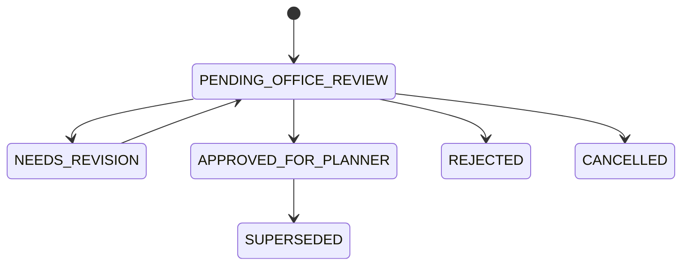
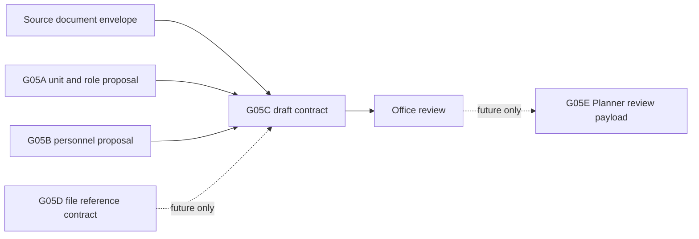
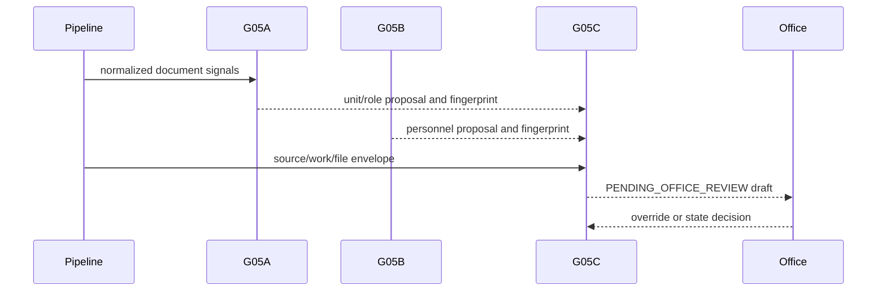

# G05C Assignment Draft Contract

## 1. Goal

G05C defines a library-only Assignment Draft contract that merges a source
document envelope with deterministic G05A unit/role and G05B personnel
proposals. One SmartOffice document creates exactly one draft. One draft may
later create at most one Planner KPI task. The mandatory initial status is
`PENDING_OFFICE_REVIEW`; the result is a proposal, never an automatic
leadership approval or task assignment.

## 2. Scope and Non-goals

G05C designs request/result contracts, state, validation, confidence, warnings,
idempotency, versioning, Office override, and audit. It does not implement a
production engine, schema, migration, persistence, Planner payload, SharePoint
file contract, Planner identity mapping, UI, or runtime integration.

It does not call AI, QLVB, SharePoint, or Planner KPI; import Excel v1; split a
document into automatic tasks; persist binary/Base64, source full text, raw AI
response, prompt, chain of thought, credentials, tokens, cookies, or local/UNC
paths.

## 3. G05A Input Mapping

These fields are verified in `AssignmentRecommendation` and its input signals.

| Field | Type | Required | Source/validation | Meaning | G05A persistence |
|---|---|---:|---|---|---:|
| `document_id` | string | yes | normalized signal | canonical document id | yes |
| `document_revision` | string | yes | normalized signal | canonical revision | yes |
| `input_fingerprint` | SHA-256 | yes | canonical signal input | rule proposal identity | yes |
| `primary_rule` | candidate/null | no | engine ranking | primary rule evidence | candidate history |
| `decision` | `MatchDecision` | yes | enum | rule decision | yes |
| `confidence` | 0-100 number | yes | primary score or 0 | assignment confidence | score |
| `lead_unit_key` | nullable string | no | primary rule unit | proposed lead unit | derived |
| `coordinating_unit_keys` | string list | yes | primary rule units | participating units | derived |
| `required_roles` | role-code list | yes | primary rule roles | required routing roles | derived |
| `unresolved_fields` | string list | yes | engine | fields needing review | no |
| `warnings` | warning enum list | yes | engine | rule warnings | JSON |
| `conflicting_rules` | candidate list | yes | engine | top-rule conflict evidence | history |
| `engine_version` | string | yes | constant | `g05a.engine.1` | fingerprint input |

G05A input signals contain tenant, document id/revision, document type, issuer,
domains, actions, keywords, entities, expected outputs, title, summary, and
reference date. It does not output source system, document number, issued or
received date, file metadata, Planner identity, or a personnel proposal. G05C
must receive those fields through its source-document envelope.

## 4. G05B Input Mapping

These fields are verified in `PersonnelSelectionRecommendation` and role
recommendations.

| Field | Type | Required | Meaning | G05B persistence |
|---|---|---:|---|---:|
| `document_id` / `document_revision` | strings | yes | document identity | yes |
| `assignment_rule_match_id` | nullable string | no | optional G05A history reference | yes if supplied |
| `unit_id` / `unit_source_key` | nullable/string | yes | resolved unit identity | unit id |
| `role_recommendations` | ordered list | yes | proposal per requested role | evaluations |
| `selected_personnel_id(s)` | nullable/list | no | selected directory person | yes |
| `selected_source_person_key` | nullable string | no | stable directory source key | not separate |
| `alternative_candidates` | candidate list | yes | deterministic alternatives | evaluations |
| `unresolved_roles` / `conflicting_roles` | role lists | yes | Office actions | diagnostics |
| `overall_confidence` | 0-100 number | yes | personnel confidence | scores |
| `warnings` | code list | yes | personnel warnings | JSON |
| `input_fingerprint` | SHA-256 | yes | personnel proposal identity | yes |
| `engine_version` | string | yes | `g05b.selection.1` | fingerprint input |
| `is_substitute` | boolean | candidate only | supporting substitute metadata | not a column |

G05B is personnel proposal only. It has no Planner user id, SharePoint identity,
or email identity. `full_name` is display data, not identity. Office may
replace, remove, or add people; a substitute is only a supporting suggestion.

## 5. Proposed G05C Input Contract

This is design only, not an implemented class or database schema.

```text
AssignmentDraftRequest
  request_metadata
    request_id, tenant_id, reference_date, requested_by, correlation_id,
    source_pipeline_version
  source_document
    source_system, source_document_id, document_number, issued_date,
    received_date, document_type, issuing_authority, subject,
    normalized_summary, source_status
  g05a_proposal
    proposed_lead_unit, proposed_participating_units, required_roles,
    assignment_rule_result, assignment_confidence, assignment_warnings,
    assignment_fingerprint, rule_engine_version
  g05b_proposal
    proposed_personnel_by_role, alternatives_by_role, unresolved_roles,
    conflicting_roles, personnel_confidence, personnel_warnings,
    personnel_fingerprint, personnel_engine_version
  work_proposal
    proposed_task_title, proposed_task_description, proposed_priority,
    proposed_start_date, proposed_due_date, proposed_deliverables,
    proposed_checklist_items, proposed_milestones
  file_reference_placeholders
    source_attachment_id, document_kind, filename, mime_type, size_bytes,
    checksum, external_reference_status
```

File references are opaque placeholders. No SharePoint site/drive/item identity
or URL belongs in G05C; G05D owns the later file-reference contract.

## 6. Proposed Output Contract

An `AssignmentDraft` has immutable `draft_id`, `tenant_id`, source document
identity, positive `draft_version`, status, proposed task (including expected
outputs), units, personnel,
alternatives, unresolved items, warnings, component/overall confidence, file
placeholders, review requirements, source engine versions/fingerprints,
SHA-256 `draft_fingerprint`, creation metadata, optional
`supersedes_draft_id`, and audit summary.

It excludes Planner task/user ids, SharePoint ids, credentials, binary, Base64,
source full text, raw AI content, and chain of thought.

## 7. State Model

Only `PENDING_OFFICE_REVIEW` is mandatory. Other states below are proposed and
require business approval.

| State | May enter | Preconditions | Terminal | Editable |
|---|---|---|---:|---:|
| `PENDING_OFFICE_REVIEW` | G05C system | hard validation passed | no | yes, Office |
| `NEEDS_REVISION` | Office | material review issue | no | yes |
| `APPROVED_FOR_PLANNER` | Office reviewer or authorized workflow administrator | review requirements complete | terminal in G05C | new version for material edit |
| `REJECTED` | authorized reviewer | reason recorded | yes | no |
| `SUPERSEDED` | system/reviewer | successor references it | yes | no |
| `CANCELLED` | authorized reviewer | reason recorded | yes | no |

SmartOfficeAI360 does not replace leadership approval, but no separate
leadership-approval state is required before the Office moves a draft to
`APPROVED_FOR_PLANNER`. This state means only that a later module may prepare a
Planner payload; it does not mean a Planner task exists. No Planner runtime state
belongs in G05C. A material edit after approval creates a new
`PENDING_OFFICE_REVIEW` version and links `supersedes_draft_id`; it never
overwrites history.



## 8. Validation Policy

Hard validation prevents creation only for missing tenant id, missing source
document id, invalid source identity, schema-invalid payload, security-limit
violation, invalid source fingerprint, payload that cannot be normalized safely,
or an idempotency collision that cannot be classified.

Soft validation still creates `PENDING_OFFICE_REVIEW` with warnings for missing
handler/co-executor, personnel or unit conflict, missing due date/output,
unavailable or substitute personnel, low confidence, missing file reference, or
incomplete summary. Missing personnel and substitute personnel must never block a
draft. Due-date precedence is: an explicit document date, an extracted normalized
content date, then Office entry or adjustment. If no date is known, emit
`DUE_DATE_REVIEW_REQUIRED` and keep `PENDING_OFFICE_REVIEW`; no fixed default is
invented. A due date before received or proposed start date emits
`INVALID_PROPOSED_DUE_DATE` without silent correction.

## 9. Confidence and Warning Policy

Proposed required components are assignment, personnel, work-content, deadline,
and deliverable confidence. Missing required component confidence is 0.

```text
overall_confidence = MIN(required component confidences)
```

Priority defaults to `NORMAL`. `HIGH` or `URGENT` is proposed only where document
content or metadata explicitly indicates urgent handling, such as urgent terms,
special short handling time, or immediate direction. Low confidence or missing
personnel never implies urgency. Office may override priority.

Each warning has a deterministic code, severity, scope, optional role/field,
short message, source engine, and recommended review action. Proposed bounds are
at most 16 warnings, 80 characters per short message, and a bounded serialized
payload. Warnings are canonicalized by code/scope/role/message and must not
contain sensitive data.

## 10. Idempotency and Versioning

Canonical input normalizes source identity; sorted units, personnel, warnings,
checklist, deliverables, and milestones; and G05A/G05B fingerprints.
`draft_fingerprint` is SHA-256 over this normalized business input, excluding
timestamps and database ids.

The same idempotency key and canonical input returns the existing draft. Changed
input creates an append-only version with `supersedes_draft_id`; older versions
are never overwritten. Exact storage mechanics are deferred.

## 11. Office Override and Audit

Office may edit task title/description, lead/participating units, leader,
monitor, lead executor, co-executors, due date, priority, deliverables,
checklist, milestones, and notes.

AI proposes deliverables, checklist items, and milestones; Office may add,
edit, delete, and reorder them. Missing deliverables emits
`DELIVERABLE_REVIEW_REQUIRED` but does not block the one-document/one-draft
rule. Multiple document requirements remain checklist, deliverable, or milestone
items in the same draft and are never auto-split into tasks.

Each override proposes an append-only audit item:
`field`, `value_before`, `value_after`, `changed_by`, `changed_at`,
`reason`, and source `AI_PROPOSAL` or `OFFICE_OVERRIDE`. Audit never stores
user authentication material.

## 12. Security and Determinism

All text, lists, and file placeholders are bounded. Initial contract limits are
20 deliverables, 50 checklist items, 20 milestones, 20 participating units, 30
co-executors, and 50 warnings. Limits are 300 characters for task title, 10,000
for task description, 1,000 per deliverable/checklist/milestone text, and 4,000
for an Office note. An over-limit payload is a hard validation error with a
clear code; it is never silently truncated.

Reject tokens, cookies,
authorization values, Planner payloads, SharePoint URL/id, local/UNC paths, raw
SQL, stack traces, binary, and Base64. Cross-tenant identity is a hard failure.

Output order is canonical. No business fingerprint depends on timestamp,
generated database id, display name, or database insertion order.

## 13. Edge-case Matrix

| Condition | Expected status | Validation | Draft | Review action |
|---|---|---|---:|---|
| 1. Units and people complete | PENDING_OFFICE_REVIEW | soft clean | yes | review proposal |
| 2. Unit exists, handler missing | PENDING_OFFICE_REVIEW | soft | yes | assign handler |
| 3. Handler exists, leader missing | PENDING_OFFICE_REVIEW | soft | yes | assign leader |
| 4. Personnel conflict | PENDING_OFFICE_REVIEW | soft | yes | resolve role conflict |
| 5. Unit conflict | PENDING_OFFICE_REVIEW | soft | yes | choose lead unit |
| 6. Substitute only | PENDING_OFFICE_REVIEW | soft | yes | confirm substitute; it is optional |
| 7. Proposed person unavailable | PENDING_OFFICE_REVIEW | soft | yes | replace person |
| 8. Due date unknown | PENDING_OFFICE_REVIEW | soft | yes | enter due date |
| 9. Due date before received date | PENDING_OFFICE_REVIEW | soft | yes | confirm exception |
| 10. Multiple deliverables | PENDING_OFFICE_REVIEW | soft clean | yes | keep one draft/task |
| 11. Multiple source files | PENDING_OFFICE_REVIEW | soft clean | yes | retain placeholders |
| 12. No source file | PENDING_OFFICE_REVIEW | soft | yes | attach or confirm none |
| 13. Same unchanged document | existing version | idempotent | no new | return existing |
| 14. Same document, changed content | PENDING_OFFICE_REVIEW | version | yes | supersede old |
| 15. G05A fingerprint changed | PENDING_OFFICE_REVIEW | version | yes | review units/rules |
| 16. G05B fingerprint changed | PENDING_OFFICE_REVIEW | version | yes | review personnel |
| 17. Warning limit exceeded | none | hard | no | reject payload |
| 18. Token/path/URL sensitive value | none | hard | no | reject payload |
| 19. Cross-tenant payload | none | hard | no | reject payload |
| 20. Many document requests | PENDING_OFFICE_REVIEW | soft clean | yes | checklist/deliverables |
| 21. Withdrawn document | CANCELLED | business policy | no new | audit `SOURCE_DOCUMENT_WITHDRAWN` |
| 22. Replacement document | SUPERSEDED | business policy | yes | link successor/new draft |
| 23. Urgent deadline | PENDING_OFFICE_REVIEW | soft clean | yes | prioritize review |
| 24. No task for local unit | REJECTED | business decision | no | audit `NO_ACTION_REQUIRED` |
| 25. Office must enter person | PENDING_OFFICE_REVIEW | soft | yes | manual override |

## 14. Components and Sequence





## 15. Boundaries G05C-G06

- G05C: Assignment Draft contract, G05A/G05B merge, confidence/warnings, review.
- G05D: SharePoint file-reference contract.
- G05E: Planner review payload.
- G05F: Assignment Workbench UI.
- G06: Planner identity mapping.

G05C must not implement these later-module responsibilities.

## 16. Not Implemented

No production G05C engine, schema/migration, persistence, Planner/SharePoint
call, Planner identity mapping, UI, Excel import, real-data ingestion, or task
sync is included in this phase.

## 17. Resolved Business Decisions and Non-blocking Backlog

The nine Phase 0 business questions are resolved as follows:

1. An Office reviewer or authorized workflow administrator may confirm a draft;
   G05C does not require a separate leadership-approval state.
2. Due dates use explicit-document, normalized-extraction, then Office-input
   precedence. Priority defaults to `NORMAL` and elevation requires explicit
   urgency.
3. Material changes after approval create a new `PENDING_OFFICE_REVIEW` version
   and supersede the approved version; historical versions remain immutable.
4. A withdrawn source cancels an unhanded-off draft, replacement creates a
   successor version, and V1 does not auto-expire drafts.
5. Leadership approval is not mandatory before a future Planner payload. The
   Office confirmation only authorizes payload preparation.
6. A document requiring no local-unit action is rejected with
   `NO_ACTION_REQUIRED`; it is not cancelled.
7. Office may edit, reorder, add, or remove proposed deliverables, checklist
   items, and milestones. Missing deliverables require review but do not block
   the draft; multiple requirements remain in one draft without auto-splitting.
8. Payload list and text limits in this contract are approved hard-validation
   limits and must never be silently truncated.
9. Bounded warning codes, messages, sources, and actions are part of the
   contract. Exact review-SLA and notification timing are deferred without
   blocking G05C.

Non-blocking backlog:

- review-SLA reminder policy using `DRAFT_REVIEW_OVERDUE`;
- multi-channel notifications;
- automatic Planner update after handoff;
- runtime personnel reassignment; and
- a future separate leadership-approval workflow.

## 18. Acceptance Criteria

All decisions needed for G05C schema and engine planning are approved. G05C
implementation must preserve one-document/one-draft, proposal-only behavior,
hard versus soft validation, append-only versions/audit, deterministic
fingerprints, and this security boundary. Non-blocking backlog items do not
authorize implementation of Planner, notification, reassignment, or leadership
workflow behavior.
