# Báo cáo so sánh hai nguồn SmartOfficeAI360

- Thời gian khảo sát: 2026-07-18 23:43:01 +07:00
- Hệ điều hành: Microsoft Windows 11 Home 10.0.26200
- Python: 3.14.6
- Node.js: 24.18.0
- Phạm vi: chỉ đọc; không sửa mã nguồn, không đổi config, không cài dependency, không build, không gọi QLVB thật, không sync Planner KPI thật.

## 1. Tóm tắt điều hành

Kết luận đề xuất là **Phương án C**: chọn **Nguồn A (`D:\Laptrinh\SmartOfficeAI360`) làm nền chính**, sau đó tạo một repository chuẩn mới từ nền A để tiếp tục nâng cấp, và **chỉ tái triển khai có chọn lọc** một số ý tưởng/module từ Nguồn B.

Lý do chính:

1. **Downloader của A an toàn và gần production hơn**: có guard chống `about:blank`, kiểm tra host, kiểm tra `Content-Type`, reject HTML giả PDF/ZIP, validate kích thước/magic bytes, chỉ tăng `downloaded_files` khi attachment đã được xác thực. Bằng chứng chính ở `tools/qlvb_downloader/downloader.py:581-1568+`.
2. **Transport sync của A tái sử dụng tốt hơn cho Planner KPI**: có `Authorization`, `X-Idempotency-Key`, polling, retry/backoff, xử lý `401/403/429/5xx`, và không để manifest kẹt ở `SYNCING`. Bằng chứng ở `tools/qlvb_downloader/sync_client.py:209-620`.
3. **Kiến trúc A tách module hợp lý hơn**: downloader/parser/storage/sync/tests/spec tương đối rõ. B trong khi đó dồn nhiều logic vào `app_unified.py` và `core/ai/vanban_ai_core.py`, làm rủi ro bảo trì tăng cao.
4. **B có giá trị tái sử dụng thực tế ở OCR, prompt/task schema và ý tưởng GUI review**, nhưng không nên lấy nguyên khối vì nợ kỹ thuật và thiếu lớp sync/runtime đáng tin cậy.

Điểm tổng hợp:

- **A = 72/100**, Upgrade Fit = **81/100**
- **B = 54/100**, Upgrade Fit = **61/100**

Kết luận sẵn sàng ra quyết định: **READY_FOR_DECISION**.

## 2. Xác minh hai nguồn

| Nội dung | Nguồn A | Nguồn B | Nhận xét so sánh |
|---|---|---|---|
| Đường dẫn | `D:\Laptrinh\SmartOfficeAI360` | `D:\Laptrinh\SmartOfficeAI360_V18_9_5_FINAL_FULL_PILOT_TEST` | Cả hai cùng tồn tại |
| Có tồn tại | Có | Có | Đã xác minh trên file system |
| Git repository | Có | Không | Đây là chênh lệch quản trị cấu hình lớn nhất |
| Git root | `D:/Laptrinh/SmartOfficeAI360` | `N/A` | B không có `.git` |
| Branch | `main` | `N/A` | A còn bảo toàn nhánh làm việc |
| Commit | `19ff09329fae5c0ce8b800688a3fc36122484082` | `N/A` | B không truy vết commit được |
| Tag gần nhất | `smartofficeai360-v22.2.2-qc-hotfix3-final` | `N/A` | A có baseline tag gần đây |
| Commit gần nhất | `2026-07-14T12:59:11+07:00` / `hotfix: resolve QLVB Lai Chau parsing & detail click issues (QC-003 Final)` | `N/A` | B thiếu lịch sử chuẩn |
| Remote | `(trống)` | `N/A` | A hiện không cấu hình remote |
| Phiên bản | `V22.2.3-QC Maintenance 1` theo launcher; README còn cũ `V22.1.5` | `V18.9.6 PERSONAL` theo `project_info.py`, fallback downloader `V18.9.5 SYSTEM HARDENING REVIEW` | A mới hơn theo nhãn, nhưng kết luận không dựa riêng vào độ mới |
| Test an toàn đã chạy | `72 passed in 56.64s` trên curated safe subset | `3 passed, 1 failed in 7.06s` | A vượt trội |

### Git status hiện tại của A

```text
 M BAT_DAU_CHAY_SMART_OFFICE_AI_360.bat
 M Data/config/qlvb_downloader_config.example.json
 M START_SMARTOFFICEAI360_GUI.bat
 M VERSION.txt
 M tests/test_parser_validation.py
 M tests/test_qc003_matrix.py
 M tests/test_storage_queue.py
 M tools/launchers/open_config_gui.bat
 M tools/qlvb_downloader/__init__.py
 M tools/qlvb_downloader/config.py
 M tools/qlvb_downloader/doctor.py
 M tools/qlvb_downloader/downloader.py
 M tools/qlvb_downloader/gui_tk.py
 M tools/qlvb_downloader/index_db.py
 M tools/qlvb_downloader/models.py
 M tools/qlvb_downloader/parser.py
 M tools/qlvb_downloader/paths.py
 M tools/qlvb_downloader/runner.py
 M tools/qlvb_downloader/storage.py
?? Data/index.db
?? Data/quarantine/wrong_source_downloads/
?? Data_Investigation/
?? Data_backup_before_golden_smoke_20260714_173212/
?? Data_backup_before_golden_smoke_20260714_173225/
?? Data_backup_pre_hotfix5/
?? Data_smoke_golden_path/
?? Data_smoke_golden_path_retry_20260714_1740/
?? audit_recovery_20260718/
?? investigate.py
?? investigate_output.txt
?? restore_checkpoint_20260718/
?? scratch_batch_qc003.py
?? scratch_check_urls.py
?? scratch_db_test.py
?? test_config.py
?? tests/test_fix_qc_004.py
?? tests/test_javascript_download_adapter.py
?? tools/qlvb_downloader/repair_queue_mapping.py
```

### Git diff --stat hiện tại của A

```text
BAT_DAU_CHAY_SMART_OFFICE_AI_360.bat            |   2 +-
Data/config/qlvb_downloader_config.example.json |   2 +-
START_SMARTOFFICEAI360_GUI.bat                  |   2 +-
VERSION.txt                                     |   2 +-
tests/test_parser_validation.py                 |  65 ++-
tests/test_qc003_matrix.py                      |  28 +-
tests/test_storage_queue.py                     |  66 ++-
tools/launchers/open_config_gui.bat             |   2 +-
tools/qlvb_downloader/__init__.py               |   2 +-
tools/qlvb_downloader/config.py                 |   6 +-
tools/qlvb_downloader/doctor.py                 |  13 +-
tools/qlvb_downloader/downloader.py             | 691 +++++++++++++++++++-----
tools/qlvb_downloader/gui_tk.py                 |   8 +-
tools/qlvb_downloader/index_db.py               |  33 +-
tools/qlvb_downloader/models.py                 |  33 +-
tools/qlvb_downloader/parser.py                 | 470 +++++++---------
tools/qlvb_downloader/paths.py                  |   2 +-
tools/qlvb_downloader/runner.py                 |  83 ++-
tools/qlvb_downloader/storage.py                |  28 +-
19 files changed, 1078 insertions(+), 460 deletions(-)
```

Nhận xét:

- A **không sạch working tree**. Các hardening quan trọng, nhất là ở `downloader.py` và `parser.py`, đang nằm ở trạng thái **chưa commit**. Vì vậy báo cáo luôn phân biệt giữa **baseline commit** và **working tree đang có**.
- B **không phải Git repo**, vì vậy không thể đối chiếu `branch/commit/tag/common ancestor` bằng metadata Git.

### Artifact phát sinh tại B do chạy test an toàn

Các file/cache sau đang tồn tại trong B sau khi chạy `pytest`; **không xóa theo yêu cầu**:

- `D:\Laptrinh\SmartOfficeAI360_V18_9_5_FINAL_FULL_PILOT_TEST\.pytest_cache\.gitignore`
- `D:\Laptrinh\SmartOfficeAI360_V18_9_5_FINAL_FULL_PILOT_TEST\.pytest_cache\CACHEDIR.TAG`
- `D:\Laptrinh\SmartOfficeAI360_V18_9_5_FINAL_FULL_PILOT_TEST\.pytest_cache\README.md`
- `D:\Laptrinh\SmartOfficeAI360_V18_9_5_FINAL_FULL_PILOT_TEST\.pytest_cache\v\cache\lastfailed`
- `D:\Laptrinh\SmartOfficeAI360_V18_9_5_FINAL_FULL_PILOT_TEST\.pytest_cache\v\cache\nodeids`
- `D:\Laptrinh\SmartOfficeAI360_V18_9_5_FINAL_FULL_PILOT_TEST\__pycache__\app_unified.cpython-314.pyc`
- `D:\Laptrinh\SmartOfficeAI360_V18_9_5_FINAL_FULL_PILOT_TEST\__pycache__\project_info.cpython-314.pyc`
- `D:\Laptrinh\SmartOfficeAI360_V18_9_5_FINAL_FULL_PILOT_TEST\core\ai\__pycache__\vanban_ai_core.cpython-314.pyc`
- `D:\Laptrinh\SmartOfficeAI360_V18_9_5_FINAL_FULL_PILOT_TEST\core\downloader\__pycache__\qlvb_downloader.cpython-314.pyc`
- `D:\Laptrinh\SmartOfficeAI360_V18_9_5_FINAL_FULL_PILOT_TEST\tests\__pycache__\test_core_workflow.cpython-314-pytest-9.1.1.pyc`
- `D:\Laptrinh\SmartOfficeAI360_V18_9_5_FINAL_FULL_PILOT_TEST\tests\__pycache__\test_core_workflow.cpython-314.pyc`
- `D:\Laptrinh\SmartOfficeAI360_V18_9_5_FINAL_FULL_PILOT_TEST\tools\__pycache__\system_check.cpython-314.pyc`

## 3. Quan hệ giữa hai nguồn

### Kết quả inventory mã nguồn an toàn

- A files trong phạm vi so sánh mã/config/docs/test: **82**
- B files trong phạm vi so sánh mã/config/docs/test: **86**
- Shared relative paths: **2**
- Shared relative paths identical by SHA-256: **0**
- Python stem overlap: **0.0%**
- Common ancestor Git: **không chứng minh được**, vì B không có `.git`

### Nhận xét chính

1. Hai nguồn **không còn giống nhau ở mức module/codebase**. Chỉ có `README.txt` và `requirements.txt` trùng relative path, và **cả hai cũng khác nội dung**.
2. Không tìm thấy file mã nào **trùng SHA-256 tuyệt đối** giữa hai nguồn trong phạm vi so sánh an toàn.
3. Rủi ro vận hành lớn là **dễ sao chép nhầm ý tưởng từ B vào A theo kiểu nguyên khối**, trong khi hai codebase đã diverge mạnh và dùng schema/GUI/workflow khác nhau.
4. Dữ liệu có thể di chuyển ở mức **khái niệm**, nhưng **không nên chuyển thẳng thư mục/queue**. Cần map qua schema chuẩn mới.

### Bảng so sánh module/file trọng yếu

| Module/File | A | B | Giống nhau | Khác biệt chính | Có thể kế thừa |
|---|---|---|---|---|---|
| requirements.txt | Có | Có | Không | Bộ thư viện khác nhau; A tập trung downloader/sync, B thêm OCR/AI/openai/pytesseract/rarfile | Một phần |
| README.txt | Có | Có | Không | Nội dung mô tả khác nhau | Không đáng kể |
| downloader | tools/qlvb_downloader/downloader.py | core/downloader/qlvb_downloader.py | Không | A validate file + page context tốt hơn; B có NeoRemoting/doc_id heuristics | Có |
| parser/extractor | parser.py + extractor.py | vanban_ai_core.py + downloader helpers | Không | A tách parser/schema; B gắn extractor/OCR/AI vào monolith | Có |
| GUI | gui_tk.py | app_unified.py | Không | B giàu màn hình hơn; A gọn hơn và ít nợ hơn | Có, ở mức ý tưởng |
| sync/planner | sync_client.py | export M365/Planner CSV trong app_unified.py | Không | A có HTTP transport, B chủ yếu export/manual | Có |

## 4. Kiến trúc Nguồn A

### Nhận diện thành phần

- Ngôn ngữ chính: Python
- GUI: `customtkinter` (`tools/qlvb_downloader/gui_tk.py:22` - `class ConfigApp(ctk.CTk)`)
- Browser automation: Playwright (`requirements.txt`, `downloader.py`)
- Entrypoint GUI: `START_SMARTOFFICEAI360_GUI.bat`, `tools/qlvb_downloader/gui_tk.py`
- Entrypoint CLI/runner: `tools/qlvb_downloader/runner.py`, `doctor.py`
- Packaging: `SmartOfficeAI360.spec`
- Storage/queue: `storage.py`, `index_db.py`, `models.py`
- Sync client: `sync_client.py`
- Parser/extractor: `parser.py`, `extractor.py`
- Logging/audit: `logger` hidden import trong spec; `audit_queue` hidden import trong spec

### Luồng kiến trúc A

```mermaid
flowchart LR
    QLVB[QLVB] --> Login[Đăng nhập / login gate]
    Login --> List[Chọn incoming/outgoing list]
    List --> Detail[Mở detail record]
    Detail --> Attach[Phát hiện attachment]
    Attach --> Download[Tải qua download event / response / request / JS adapter]
    Download --> Validate[Validate content-type / magic bytes / size / HTML giả tệp]
    Validate --> Store[Lưu attachment + manifest + SQLite]
    Store --> Extract[Trích xuất văn bản / metadata]
    Extract --> Queue[READY queue]
    Queue --> Sync[Document ingest sync client]
```



### Bằng chứng chính của A

- Đăng nhập và định hướng incoming/outgoing: `tools/qlvb_downloader/downloader.py:429-520`
- Bộ đếm process và điều kiện tăng `downloaded_files`: `tools/qlvb_downloader/downloader.py:581-710`
- Guard detail page / chặn `about:blank`: `tools/qlvb_downloader/downloader.py:1046-1061`
- Retry + validate attachment: `tools/qlvb_downloader/downloader.py:1253-1568+`
- Manifest v2 + hash + READY marker cuối cùng: `tools/qlvb_downloader/storage.py:209-300`
- Transport sync có idempotency/polling/retry/backoff: `tools/qlvb_downloader/sync_client.py:209-620`

## 5. Kiến trúc Nguồn B

### Nhận diện thành phần

- Ngôn ngữ chính: Python
- GUI: Tkinter/custom app hợp nhất trong `app_unified.py`
- Browser automation: Playwright (`requirements.txt`, `core/downloader/qlvb_downloader.py`)
- Entrypoint: `0_Khoi_dong_He_thong.bat` -> `app_unified.py`
- Packaging: `0_Dong_goi_EXE.bat` + PyInstaller CLI
- Downloader: `core/downloader/qlvb_downloader.py`
- OCR/AI: `core/ai/vanban_ai_core.py`
- Storage: SQLite + `workspace_shared/QUEUE/READY`
- M365/Planner/SharePoint: export package, CSV, hướng dẫn Flow trong `app_unified.py`

### Luồng kiến trúc B


### Bằng chứng chính của B

- Dynamic loading downloader + AI core: `app_unified.py:23-62`
- Downloader config + auth-state: `core/downloader/qlvb_downloader.py:152-196`, `351-364`
- NeoRemoting attachment list: `core/downloader/qlvb_downloader.py:581-617`
- Direct request download: `core/downloader/qlvb_downloader.py:829-843`
- OCR tiếng Việt: `core/ai/vanban_ai_core.py:127-174`, `376-404`
- Prompt AI và parse output nhãn tự do: `core/ai/vanban_ai_core.py:444-511`, `651-730`
- Export package cho M365/Planner/SharePoint: `app_unified.py:2003-2198`

## 6. So sánh chức năng tổng thể

| Nhóm chức năng | Nguồn A | Nguồn B | Nhận xét so sánh |
|---|---|---|---|
| Đăng nhập & duy trì session | Có, có login gate + host/page guard | Có, lưu auth state + pause/resume relogin | A an toàn hơn về context; B thuận tiện hơn cho relogin tay |
| Văn bản đến | Có bằng chứng rõ | Có bằng chứng rõ | Hai bên đều làm được incoming |
| Văn bản đi | Có bằng chứng `open_document_direction` | Chưa thấy bằng chứng chắc | A tốt hơn |
| Validate tải tệp | Có mạnh | Yếu | Đây là khác biệt quyết định |
| Parser/manifest | Tốt | Trung bình | A mạnh hơn ở dữ liệu/trạng thái |
| OCR tiếng Việt | Chưa hoàn chỉnh | Có | B tốt hơn |
| AI action items | Gần như chưa có | Có ở mức prototype/manual | B tốt hơn |
| Review/approve workflow | Chưa có | Có manh nha qua routing/dashboard | B tốt hơn nhưng chưa đủ production |
| Planner KPI runtime sync | Có transport gần dùng được | Chưa có runtime | A tốt hơn rõ |
| Audit/quarantine | Có | Không thấy tương đương | A tốt hơn |

## 7. So sánh downloader

### 7.1 Nguồn nào ít nguy cơ báo DONE/READY giả hơn?

**Nguồn A**.

Bằng chứng:

- `downloaded_files` ở A chỉ tăng bằng số attachment đã `ATTACHMENT_VALIDATED` tại `tools/qlvb_downloader/downloader.py:691`.
- `_process_record` chỉ set `DOCUMENT_READY` khi có valid attachment và không có invalid; nếu vừa valid vừa invalid thì `DOCUMENT_READY_WITH_WARNINGS`; nếu không có valid thì `DOCUMENT_NO_VALID_ATTACHMENT` (`downloader.py:972-1016`).
- `_validate_downloaded_file` kiểm tra file tồn tại, kích thước, `Content-Type`, HTML giả dạng, và đặc trưng định dạng (`downloader.py:1527-1568+`).
- B trong `download_attachment_via_request` chỉ cần `resp.ok` và body khác rỗng để ghi file (`core/downloader/qlvb_downloader.py:829-843`), chưa có bằng chứng validate file tương đương trước khi đồng bộ vào READY.

### 7.2 Nguy cơ bắt nhầm response hoặc nhầm page context

- **A thấp hơn** vì `_is_download_response_candidate` lọc theo HTTP 200, host/path cho phép, `Content-Disposition`, loại trừ `text/html`, và context mong đợi (`downloader.py:1316-1337`).
- **A có guard `about:blank`** trong `_ensure_usable_detail_page` và JS runtime capture (`downloader.py:1046-1061`, `1477-1519`).
- **B không thấy guard mạnh tương đương**; luồng tải qua `context.request.get` với URL dựng sẵn đơn giản hơn nhưng ít bảo vệ hơn trước dữ liệu trả sai.

### 7.3 Văn bản đi đã phát hành

- **A có bằng chứng** cho phân nhánh incoming/outgoing tại `open_document_direction` (`downloader.py:461-520`).
- **B chưa thấy bằng chứng rõ** cho luồng outgoing; config/menu chủ yếu xoay quanh văn bản đến.

### 7.4 Phần có thể tái sử dụng từ B

- `get_attachment_list` dùng `window.NEORemoting.getRSet(...)` để lấy danh sách tệp (`core/downloader/qlvb_downloader.py:581-617`)
- `build_download_url` / `download.jsp` adapter (`core/downloader/qlvb_downloader.py:619-624`)
- `doc_id` extraction heuristics từ HTML/onclick/row id (`core/downloader/qlvb_downloader.py:509-579`)

Kết luận downloader: **A giữ nguyên làm nền; B chỉ nên cung cấp adapter/heuristic bổ trợ.**

## 8. So sánh parser, extractor, OCR và storage

### A mạnh ở đâu

- `parser.py:61-317` có canonical header mapping, row scoring và phân loại `VALID/SUSPICIOUS/INVALID`.
- `storage.py:137-300` chỉ queue hồ sơ khi có attachment hợp lệ, đồng thời tính SHA-256, lưu manifest schema `2.0.0`, và chỉ ghi `.ready`/`READY.ok` ở bước cuối.
- `models.py:54-128` đã có `AttachmentInfo` / `DocumentRecord` với các trường validation, trạng thái, metadata.

### B mạnh ở đâu

- `vanban_ai_core.py:127-174` và `376-404` đã có OCR tiếng Việt bằng `pytesseract` + `PyMuPDF`.
- `vanban_ai_core.py:312-371` có logic đọc metadata từ vùng đầu PDF, hữu ích cho trích số ký hiệu/ngày/cơ quan.
- `requirements.txt` của B có thêm `pillow`, `pytesseract`, `rarfile`, `pymupdf`, `openai`.

### Kết luận parser/storage

- **Parser + storage tổng thể**: chọn **A**.
- **OCR/extractor bổ sung**: lấy **B** làm nguồn tham khảo/chọn lọc.
- **Khả năng chuyển đổi sang schema mới**: A thuận lợi hơn nhiều, vì đã có manifest/status/hash/SQLite rõ hơn để mở rộng sang `ActionItem`, `SourceCitation`, `ReviewDecision`, `SyncEvent`, `UserUnitMapping`.

## 9. So sánh GUI và quy trình người dùng

### A

- Tabs hiện có: overview, login_gate, config, download, queue, sync, logs, help (`gui_tk.py:82-131`)
- Có queue filter, manifest view, sync now, audit, quarantine (`gui_tk.py:350-456`, `1363-1433`)
- Mạnh ở thao tác downloader/sync vận hành cơ bản

### B

- Có dashboard danh sách theo dõi (`app_unified.py:1187-1225`)
- Có routing/task suggestion dict với `task`, `confidence`, `reason`, `unit/leader/officer` (`app_unified.py:1621-1665`)
- Có M365 config, export lists/planner CSV, SharePoint package (`app_unified.py:1882-2198`)
- Có one-click flow login -> crawl -> AI handoff (`app_unified.py:3710-3785`)

### Kết luận GUI

- **B có GUI giàu tính năng hơn** và phù hợp hơn để lấy cảm hứng cho màn hình review/approve task.
- **Không nên bê nguyên `app_unified.py`**. Nên thiết kế lại review workflow trên nền dữ liệu/module của A.

## 10. So sánh Planner KPI / SharePoint / OneDrive

### A

- Endpoint upload: `/api/document-ingest/upload` (`sync_client.py:209-267`)
- Polling status: `/api/document-ingest/status/{id}` (`sync_client.py:99-119`)
- Có `Authorization`, `X-Idempotency-Key`, retryable codes `{429,500,502,503,504}`, `AUTH_FAILED`, backoff, batch sync (`sync_client.py:52`, `75-84`, `338-460`, `474-620`)
- Đây là **transport layer tái sử dụng tốt nhất** để chuyển sang approved-task sync trong tương lai

### B

- Không thấy runtime API sync client cho Planner KPI
- Có export package/guides cho Microsoft Lists, Planner CSV, Power Automate, SharePoint-ready structure (`app_unified.py:2003-2198`)
- Có ý tưởng trường dữ liệu như `PlannerTaskId`, `PlannerTaskUrl`, `FlowStatus`, phù hợp tham khảo cho schema mới

### Kết luận Planner KPI

- **Nguồn tốt hơn hiện tại: A**
- **Ý tưởng trường dữ liệu đáng học từ B**: mô hình mapping M365/Planner/FlowStatus
- **Mức sẵn sàng chung cho approved-task sync**: A = `PARTIAL`, B = `NOT READY`

## 11. Test và khả năng xác minh

### Test đã chạy an toàn

1. **Nguồn A**
   - Lệnh: `python -m pytest -q -p no:cacheprovider tests/test_detail_action.py tests/test_fix_qc_004.py tests/test_header_row_filter.py tests/test_parser_validation.py tests/test_qc003_matrix.py tests/test_navigation_menu.py tests/test_javascript_download_adapter.py tests/test_storage_queue.py`
   - Kết quả: **72 passed in 56.64s**
   - Lý do an toàn: bộ test dùng mock/temp/local; không truy cập QLVB thật và không sync Planner KPI thật.
   - Phủ chức năng: downloader guards, JS download adapter, parser validation, storage queue, navigation/detail handling.

2. **Nguồn B**
   - Lệnh: `python -m pytest -q -p no:cacheprovider tests/test_core_workflow.py`
   - Kết quả: **3 passed, 1 failed in 7.06s**
   - Lỗi: `RuntimeError: Thiếu thư viện openpyxl để ghi file Excel` tại `core/ai/vanban_ai_core.py:1361`
   - Lý do an toàn: dùng `tempfile.TemporaryDirectory()` và dữ liệu local.

### Đánh giá test

- A có bộ test phản ánh gần production hơn cho downloader/parser/storage.
- B có test mỏng và failure hiện hữu, nên độ tin cậy thấp hơn đáng kể.
- Trong lần khảo sát này **không chạy** các test có dấu hiệu ghi vào `Data_*` trong repo A khi chưa cô lập đường dẫn.

## 12. Bảo mật và an toàn

### Điểm mạnh

- A có validate file, host/page guard, retry/backoff, không để sync kẹt `SYNCING`.
- B dùng `keyring` theo hằng số `project_info.py`, cho thấy ý định tách secret khỏi mã nguồn.

### Rủi ro đáng chú ý

- B có `eval(data)` trong `get_attachment_list` (`core/downloader/qlvb_downloader.py:581-617`).
- B tạo artifact `.pytest_cache` và `__pycache__` trong repo khi chạy test.
- A chưa có OCR runtime và review workflow, nhưng đó là thiếu chức năng hơn là lỗ hổng trực tiếp.
- Chưa xác minh đầy đủ mọi file dữ liệu ngoài phạm vi inventory an toàn; do đó không kết luận tuyệt đối về việc không có secret trong toàn bộ Data/session.

## 13. Nợ kỹ thuật

### 15 rủi ro cao của A

1. Các hardening quan trọng của A đang ở working tree chưa commit; baseline chính thức và trạng thái đang chạy thật chưa đồng nhất.
2. Chưa có OCR runtime để xử lý PDF scan/ảnh trong pipeline chính.
3. Chưa có pipeline AI action-item nhiều nhiệm vụ, citation, confidence và schema validation cho đầu ra task.
4. GUI chưa có màn hình review/approve/reject/sync lại cho nhiệm vụ đã bóc tách.
5. Sync hiện tại hướng document-ingest, chưa phải approved-task sync sang Planner KPI.
6. Một số test khác trong A có thể tạo thư mục Data_* nếu chạy nhầm không đúng chế độ; cần cô lập rõ hơn.
7. Định dạng tài liệu ngoài PDF/DOCX/TXT còn hạn chế; chưa thấy hỗ trợ XLS/XLSX/ảnh/ZIP/RAR đầy đủ trong extractor chính.
8. Chưa có bằng chứng lock chống chạy hai phiên desktop đồng thời.
9. Chưa xác minh backup/restore production và crash recovery end-to-end trên dữ liệu thật có kiểm soát.
10. README/version docs chưa đồng bộ với launcher và tag gần nhất.
11. Chưa thấy mapping người dùng/đơn vị/lãnh đạo cho task đích.
12. Chưa có reconcile giữa nhiệm vụ đã sync và thay đổi sau phê duyệt.
13. Chưa xác minh kiểm tra dung lượng đĩa và file quá lớn trong luồng chính.
14. Các module changed nhiều như downloader.py/parser.py chưa có commit review độc lập.
15. Không có bằng chứng pilot approved-task sync với API Planner KPI thật ở phạm vi an toàn.

### 15 rủi ro cao của B

1. Nguồn B không phải Git repository; không truy vết được lịch sử, branch, commit hay common ancestor bằng metadata chuẩn.
2. `app_unified.py` (~4091 dòng) và `vanban_ai_core.py` (~2938 dòng) là monolith lớn, khó kiểm soát regressions.
3. Downloader B thiên về văn bản đến; chưa thấy bằng chứng chắc cho văn bản đi đã phát hành.
4. `download_attachment_via_request` ghi file nếu response ok và body không rỗng, nhưng không kiểm tra magic bytes/HTML giả tệp trước READY.
5. `get_attachment_list` dùng `eval(data)`, tăng rủi ro code execution nếu dữ liệu trả về bất thường.
6. Planner/SharePoint/M365 mới là export package và hướng dẫn Flow thủ công, chưa phải runtime sync client.
7. AI đầu ra dạng nhãn tự do; không có JSON schema/validation/citation/offset trang đáng tin cậy.
8. Test hiện tại mỏng; safe run cho thấy 1 test fail do thiếu `openpyxl`.
9. Build bat tự chạy `pip install pyinstaller`, không phù hợp quy trình production kiểm soát chặt.
10. Một số dữ liệu workspace/debug nằm chung trong source tree, dễ lẫn artifact với mã nguồn.
11. Queue/status schema đơn giản hơn A, khó mở rộng cho review decision và sync audit chi tiết.
12. Không có transport layer idempotent cho approved-task sync.
13. One-click flow login -> crawl -> AI handoff tăng blast radius khi lỗi giữa chừng.
14. Không thấy module audit/quarantine độc lập tương đương A.
15. Safe test đã tạo cache artifacts trong repo B; bản thân repo chưa được giữ sạch khỏi công cụ chạy kiểm tra.

### 15 khoản nợ kỹ thuật làm chậm lộ trình mới

1. Thiếu một schema đích thống nhất cho Document, Attachment, ActionItem, SourceCitation, ReviewDecision, SyncEvent.
2. Thiếu review queue durable tách khỏi queue ingest/download.
3. Thiếu adapter chuẩn hóa cho hai kiểu discovery tệp: DOM/response capture của A và NeoRemoting của B.
4. OCR của B chưa tách module; extractor của A chưa có OCR runtime.
5. Chưa có user/unit mapping service dùng chung.
6. Chưa có approved-task sync contract rõ ràng thay cho document-ingest.
7. Thiếu contract test/idempotency test cho Planner KPI integration.
8. Thiếu E2E mô phỏng đầy đủ QLVB -> AI -> review -> sync.
9. Versioning và baseline release chưa nhất quán giữa launcher, README, VERSION và git tag.
10. Nợ UI: chưa có màn hình chuẩn cho sửa/gộp/tách/phê duyệt task.
11. Nợ packaging: cần quy trình build sạch, đóng băng dependency và smoke test sau đóng gói.
12. Nợ observability: cần log correlation id, sync event history và dashboard lỗi.
13. Nợ dữ liệu: chưa có migration chiến lược khi chuyển từ metadata/status cũ sang schema mới.
14. Nợ an toàn: cần loại bỏ `eval(data)`, rà soát secret/config/session boundary.
15. Nợ quy trình: hardening hiệu quả ở A chưa được đưa thành commit/tag baseline chính thức.

## 14. Điểm A và B theo mục tiêu tương lai

| Tiêu chí | Trọng số | A | B | Nguồn tốt hơn | Giải thích |
|---|---:|---:|---:|---|---|
| Tải và xử lý QLVB ổn định | 25 | 21 | 13 | A | A có incoming/outgoing, validate file, chặn `about:blank` và HTML giả tệp. |
| Parser, extractor, OCR, dữ liệu | 15 | 9 | 12 | B | B có OCR tiếng Việt; A mạnh hơn về schema/storage. |
| Kiến trúc và khả năng bảo trì | 12 | 10 | 4 | A | A tách module; B monolith lớn. |
| Queue, lưu trữ, phục hồi | 8 | 7 | 5 | A | A có manifest/hash/READY marker. |
| Khả năng bổ sung AI action items | 8 | 2 | 6 | B | B đã có prompt và task fields. |
| Khả năng xây workflow duyệt nhiệm vụ | 7 | 2 | 4 | B | B có dashboard/routing/manual handoff. |
| Tích hợp Planner KPI | 10 | 8 | 3 | A | A có idempotency/polling/retry/backoff. |
| Độ ổn định và xử lý lỗi | 7 | 6 | 4 | A | A guard tốt hơn. |
| Test và khả năng xác minh | 4 | 4 | 1 | A | A có 72 test subset pass; B có 1 fail. |
| Bảo mật và vận hành production | 4 | 3 | 2 | A | A có spec/queue separation; B có `eval(data)`. |
| **Tổng** | **100** | **72** | **54** | **A** | **A là nền nâng cấp phù hợp hơn.** |

### Tổng hợp điểm

- **SCORE_A = 72/100**
- **SCORE_B = 54/100**
- **UPGRADE_FIT_A = 81/100**
- **UPGRADE_FIT_B = 61/100**

## 15. Ma trận kế thừa module

Bản đầy đủ đã xuất riêng ra: `D:\Laptrinh\SmartOfficeAI360_TWO_SOURCE_MODULE_REUSE_MATRIX.md`

## 16. Phương án được đề xuất

### Quyết định kiến trúc cuối

- **Chọn phương án C**
- **Nguồn chính**: `D:\Laptrinh\SmartOfficeAI360`
- **Cách thực hiện**: tạo một repository chuẩn mới từ Nguồn A sau khi chốt baseline review; sau đó tái triển khai có chọn lọc các ý tưởng/module từ B.

### Module giữ nguyên từ A

- downloader core
- parser/validation core
- storage + manifest + SQLite upsert
- sync client transport
- tests downloader/parser/storage
- packaging spec và launcher chính

### Module chỉnh nhẹ từ A

- config/selector để hấp thụ thêm selector thực chiến
- queue/audit UI
- sync payload để đổi từ document-ingest sang approved-task sync

### Module lấy ý tưởng hoặc code chọn lọc từ B

- NeoRemoting attachment discovery + `download.jsp` adapter
- OCR tiếng Việt bằng `pytesseract` + `PyMuPDF`
- prompt/task field concepts cho action items
- field model cho M365/Planner/SharePoint/FlowStatus
- UX dashboard/review/routing

### Module cần viết mới hoặc refactor mạnh

- ActionItem + SourceCitation schema
- Review queue và review decision workflow
- User/unit/leader mapping service
- Approved-task sync client cho Planner KPI
- E2E harness cho toàn tuyến QLVB -> AI -> review -> sync
- OCR adapter tách khỏi monolith B

## 17. Lộ trình sau khi chốt

| Giai đoạn | Mục tiêu | Nguồn thuận lợi hơn | Ước lượng |
|---|---|---|---|
| 0 | Chốt baseline, tạo repo chuẩn, đóng băng nguồn phụ | A | Small |
| 1 | Harden downloader + adapter NeoRemoting | A | Medium |
| 2 | Chuẩn hóa schema Document/Attachment/ActionItem/Citation | A | Medium |
| 3 | Tách OCR từ B vào extractor của A | Lai A+B | Medium |
| 4 | Xây review workflow và màn hình duyệt nhiệm vụ | A với UX học từ B | Large |
| 5 | Thiết kế approved-task sync Planner KPI | A | Medium |
| 6 | Idempotency/retry/audit/reconcile | A | Medium |
| 7 | E2E + pilot có kiểm soát | A | Large |
| 8 | Production packaging và SOP vận hành | A | Medium |

## 18. Những nội dung chưa thể xác minh

- Không xác minh runtime QLVB thật, popup thật, dữ liệu thật hay session thật theo yêu cầu không được thao tác hệ thống sống.
- Không xác minh API Planner KPI thật, remote ID thật hay rollback thực tế.
- Không xác minh tuyệt đối mọi secret trong Data/session vì các thư mục đó bị loại khỏi phạm vi đọc sâu để tránh lộ dữ liệu nhạy cảm.
- Không chứng minh common ancestor bằng Git do B không có `.git`.
- Không kiểm chứng build release vì bị cấm build/cài dependency.

## 19. Xác nhận sau khảo sát

- Không sửa mã nguồn hai repository.
- Không đổi cấu hình.
- Không cài dependency.
- Không build release.
- Không chạy migration.
- Không tải hoặc thay đổi dữ liệu thật.
- Không gọi sync Planner KPI thật.
- Không commit, tag hoặc push.
- **Ngoại lệ cần ghi nhận trung thực**: safe test trên Nguồn B đã tạo cache artifacts `.pytest_cache` và `__pycache__` trong chính repo B; không xóa theo yêu cầu.
- Git status của A trước và sau khảo sát: **không ghi nhận thêm mục mới do khảo sát**.
- B không phải Git repo, nên không có `git status` để so sánh; thay vào đó đã liệt kê chính xác artifact phát sinh do test.

## 20. Danh sách lệnh đã chạy

- `Get-Content -Raw 'C:\Users\tamth\.codex\attachments\4d4cb5ec-7fb3-4566-a92a-c6bd847c4021\pasted-text.txt'`
- `python --version`
- `node --version`
- `Get-CimInstance Win32_OperatingSystem | Select-Object Caption, Version`
- `git -C 'D:\Laptrinh\SmartOfficeAI360' rev-parse --show-toplevel`
- `git -C 'D:\Laptrinh\SmartOfficeAI360' branch --show-current`
- `git -C 'D:\Laptrinh\SmartOfficeAI360' rev-parse HEAD`
- `git -C 'D:\Laptrinh\SmartOfficeAI360' describe --tags --abbrev=0`
- `git -C 'D:\Laptrinh\SmartOfficeAI360' log -1 --date=iso-strict --pretty=format:'%H%n%ad%n%s'`
- `git -C 'D:\Laptrinh\SmartOfficeAI360' status --short`
- `git -C 'D:\Laptrinh\SmartOfficeAI360' diff --stat`
- `rg -n "_process_direction|_ensure_usable_detail_page|_download_by_click_or_request|_validate_downloaded_file" D:\Laptrinh\SmartOfficeAI360\tools\qlvb_downloader\downloader.py`
- `rg -n "sync_upload|sync_batch|X-Idempotency-Key|AUTH_FAILED" D:\Laptrinh\SmartOfficeAI360\tools\qlvb_downloader\sync_client.py`
- `rg -n "manifest|READY.ok|queue" D:\Laptrinh\SmartOfficeAI360\tools\qlvb_downloader\storage.py`
- `rg -n "OCR_REQUIRED|extract_text|pdf" D:\Laptrinh\SmartOfficeAI360\tools\qlvb_downloader\extractor.py`
- `rg -n "getFileAttachLst|download_attachment_via_request|sync_to_ready|crawl" D:\Laptrinh\SmartOfficeAI360_V18_9_5_FINAL_FULL_PILOT_TEST\core\downloader\qlvb_downloader.py`
- `rg -n "PROMPT_TEMPLATE|parse_ai_response|ocr_image|ocr_pdf_with_pymupdf|append_to_excel" D:\Laptrinh\SmartOfficeAI360_V18_9_5_FINAL_FULL_PILOT_TEST\core\ai\vanban_ai_core.py`
- `rg -n "routing|M365|Planner|SharePoint|FlowStatus" D:\Laptrinh\SmartOfficeAI360_V18_9_5_FINAL_FULL_PILOT_TEST\app_unified.py`
- `python -m pytest -q -p no:cacheprovider tests/test_detail_action.py tests/test_fix_qc_004.py tests/test_header_row_filter.py tests/test_parser_validation.py tests/test_qc003_matrix.py tests/test_navigation_menu.py tests/test_javascript_download_adapter.py tests/test_storage_queue.py`
- `python -m pytest -q -p no:cacheprovider tests/test_core_workflow.py`
